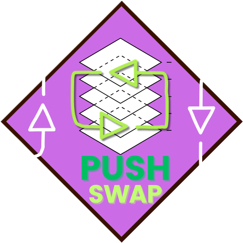

  
  <h2>42 PUSH SWAP PROJECT</h2>
    
    
    
    
    
   
<h4>
    <a href="https://github.com/emre-mr246/42_ring2_push_swap/issues">❔ Ask a Question</a>
   · 
    <a href="https://github.com/emre-mr246/42_ring2_push_swap/issues">🪲 Report Bug</a>
   · 
    <a href="https://github.com/emre-mr246/42_ring2_push_swap/issues">💬 Request Feature</a>
</h4>

## Introduction 🚀

The purpose of this project is to research sorting algorithms to sort the given data with the minimum number of moves. Additionally, the general rules of the project lead us to use linked lists, teaching us to manipulate operations with their references.

## Usage 🔍

1. In the project's main directory, compile the project and checker using the `make && make bonus` command.
   `$ make && make bonus` 

2.  After compilation, you can use the program as follows:
    `ARG="5 2 1 9 4 8"; ./push_swap $ARG | ./checker/checker $ARG`
